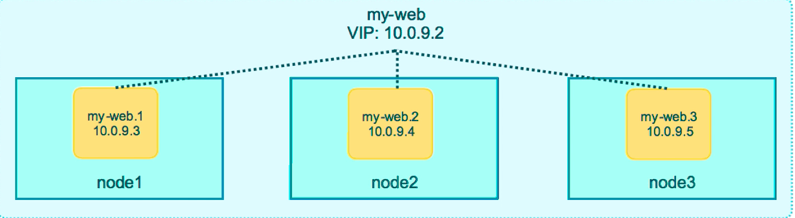
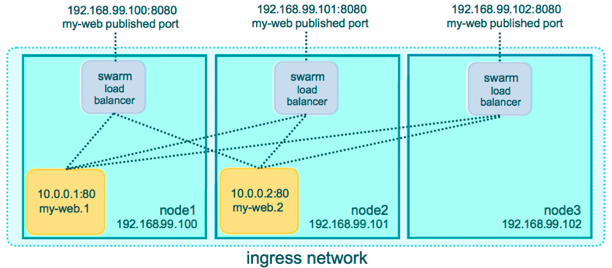
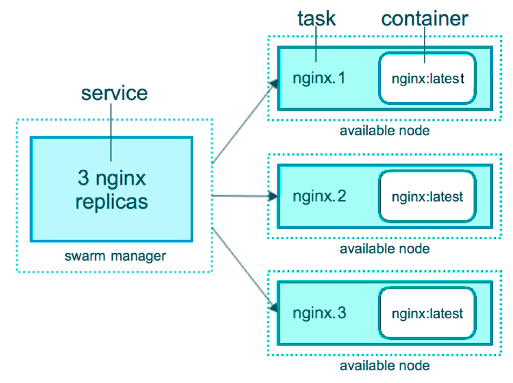

# Docker

Playground - https://labs.play-with-docker.com/

Docker is all about speed. Develop faster, deploy faster, run faster, etc.

Containers reduce complexity

Clound native landscape - https://landscape.cncf.io/

## Image vs. Container

An image is the application we want to run

A Container is an instance of that image running as a process

You can have many containers running off the same image

Images mostly are get from registry (Docker Hub)

## Container

What happens in `docker container run --publish 80:80 nginx`

1. Looks for that image locally in image cache, doesn't find anything
2. Then looks in remove image repository (defaults to Docker Hub)
3. Downloads the latest version (nginx:latest by default)
4. Creeate new container based on that image and prepares to start (it will not copy image)
5. Gives it a vistual IP on a private network inside docker engine
6. Opens up port 80 on host and forwards to port 80 in container
7. Start container by using the CMD in the image Dockerfile

`docker container run --publish 8080:80 nginx:1.11 nginx -T`  - in this command you change:

1. **8080** - change host listening port
2. **nginx:1.11** - change version of image
3. **nginx -T** - change CMD run on start

Container runs as long as commands on start of a container is runs.

Alpine Linux - a small security-focused distribution.

This distribution is amazingly small, and do not contains even bash. To install it you can use `apk update && apk add bash`

To connect to the alpine container use next command `docker container exec -it alpine sh`

Or start it in interactive mode by default docker container run -it alpine`

### Container vs VM


### Container lifetime & Persistent Data

Containers are usually immutable and ephemeral

"Immutable infrastructure": only re-deploy containers, never change

This is the ideal scenario, but what about databases, or unique data? Docker gives us features to ensure these "separation of concerns".

Docker provided two solution:

* Volumes - make special location outside of container UFS
* Bind mounts - link container path to host path

#### Persistent data: Volumes

It is possible to create named volumes, this means that this this volume will be match friendly and you can reused it. You can specify name of the volume (**docker container run -d --name mysql -e MYSQL_RANDOM_ROOT_PASSWORD=true -v mysql-db:/var/lib/mysql mysql**) when you create another container, then it will have the same volume and at the same directory on host.

#### Persistent data: Bind Mounting

Maps a host file or directory to a container file or directory

Basically just tow locations positing to the same file(s)

Again, skips UFS, and host files overwrite any in container

Can't use in Dockerfile, must be at `container run`

Adding, updating, deleting data on host will affect on container, and it works in oposite direction.

## Docker networks

By default, each container connected to a private virtual network **bridge** (docker0). 

Each virtual network routes through NAT firewall on host IP.

All containers on a virtual network can talk to each other without **-p**

Best practice is to create a new virtual network for each app:

* network **my_web_app** for mysql and php/apache containers
* network **my_api** for mongo and nodejs containers

**--network brige** - default docker virtual network, which is NAT'ed behind the Host IP. Network address translation (NAT) is a method of remapping one IP address space into another by modifying network address information in the IP header of packets while they are in transit across a traffic routing device.

**--network host** - it gains performance by skipping virtual networks sacrifices security of container model

**--network none** - removes eth0 and only leaves you with localhost interface in container

### DNS

Docker DNS - docker daemon has a build-in DNS server that containers use by default.

DNS default names - docker defaults the hostname to the container's name, but you can also set aliases

Default **bridge** network has no build in DNS server by default. To manage this you need to use command **docker container run --link**, but if you create new network it will much easier and you no need to specify link every time.

DNS Round Robin - you can 2 different host with aliases, that is response to one name.

Ever since Docker Engine 1.11, we can have multiple containers on a created network respond to the same DNS address

## Image

App binaries and dependencies. Metadata about the image data and how to run the image.

Official definition: "An Image is an ordered collection of root filesystem changes and the corresponding execution parameters for use within a container runtime"

It is not a complete OS. No kernel, kernel modules (e.g. drivers)

Can be small as one file (your app binary) like a golang static binary 

Or big as a Ubuntu distro with apt, and Apache, PHP, and more installed

### Registry

### Layers

Every image start black layer, that calls scratch.

Each layer has unique SHAA.

Image layer can be another image.

Images are always store ones on file system

Container is not coping layers inside them, they create read/write layer to work with image. It means, that multiple containers will works with one image.

Copy on Write - in case if one container make changes in the image (for example create file). System will transfer diff to the container layer. !!!!

Images are in read only status, when they run in container

### Tag

**latest** is default tag

### Dockerfile

Each line in dockerfile is layer and order is matters. Each line in dockerfile is caches, but if one line has been changes, than lines of this line will be recalculated during image build.

Order of the commands in Dockerfile is mandatory.

Docker image is inheretence every thing from image, that is used in **FROM**

Dockerfile commands:

* **FROM** - command is required command for each file. Usually it using with minimal linux distribute, but if you would like to create empty image, then you need to use **FROM scratch**
* **ENV** - set environment variable
* **RUN** - run command on the environment
* **EXPOSE**  - expose ports on the docker virtual network. You still need to use -p or -P to open/forward these ports on host
* **WORKING** - change working directory in docker image (alternative to **RUN cd**)
* **COPY** - copy file(s) from local system to working directory on an image
* **CMD** - command is rquired. This command will run every time you create or start container. Only one CMD is allowed, if there will be multiple, that the last will wins. **CMD** is not required if was represent in **FROM image**
* **VOLUME** - create new volume and signed to the directory in this command. The files will live outside the container. Volumes need to be manually deleted

## Docker Compose

https://docs.docker.com/compose/

* Configure relationships between containers
* Save our docker container run setting in easy-to-read file
* Create one-liner developer environment startup
* Comprised of 2 separate but related things

1. YAML-formatted file that describes our solution options for:
   1. containers
   2. networks
   3. volumes
   4. images
   5. env variables
2. A CLI tool docker-compose used for local dev/test automation with those YAML files

docker-compose.yml example (file name can be any value, but you need to provide it with -f attribute `docker-compose -f any-file-name.yml`)

```yaml
version: '3.1'  # if no version is specificed then v1 is assumed. Recommend v2 minimum

services:  # containers. same as docker run
  servicename: # a friendly name. this is also DNS name inside network. And should be unique through file
    image: # Optional if you use build:
    command: # Optional, replace the default CMD specified by the image
    environment: # Optional, same as -e in docker run
    volumes: # Optional, same as -v in docker run
  servicename2:

volumes: # Optional, same as docker volume create

networks: # Optional, same as docker network create
```

Ready example for Jekyll

```yaml
version: '2'

# same as 
# docker run -p 80:4000 -v $(pwd):/site bretfisher/jekyll-serve

services:
  jekyll:
    image: bretfisher/jekyll-serve
    volumes:
      - .:/site
    ports:
      - '80:4000'

```

```yaml
version: '3'

services:
  proxy:
    image: nginx:1.13 # this will use the latest version of 1.13.x
    ports:
      - '80:80' # expose 80 on host and sent to 80 in container
    volumes:
      - ./nginx.conf:/etc/nginx/conf.d/default.conf:ro
  web:
    image: httpd  # this will use httpd:latest
```

**:ro** - means, that the configuration inside container is read only

In this example docker will create private network for both of them

Compose can build custom images

It will build them with docker-compose up if not found in cache

Great for complex builds that have lots of vars or build args

```yaml
version: '2'

# based off compose-sample-2, only we build nginx.conf into image
# uses sample site from https://startbootstrap.com/template-overviews/agency/

services:
  proxy:
    build:
      context: .
      dockerfile: nginx.Dockerfile
    ports:
      - '80:80'
  web:
    image: httpd
    volumes:
      - ./html:/usr/local/apache2/htdocs/
```

## Swarm

Enable Swarm `docker swarm init`

During executing of this command docker will do next:

1. Lots of PKI and security automation
   1. Root Signing Certificate created for our Swarm
   2. Certificate is issued for first Manager node
   3. Join tokens are created
2. Raft database created to store root CA, configs and secrets
   1. Encrypted by default on disk
   2. No need for another key/value system to hold orchestration/secrets
   3. Replicates logs amongst Manages via mutual TLS in "control plane"

If one of the docker container is when down (**docker service update kind_neumann --replicas 3**), swarm will start new one to match number of replicas. **docker service ps kind_neumann** will show that one container is shutdown and required number of containers is running.

### Multiple Node

First you need to activate swarm on one node **docker swarm init** (probably you need to use property **--advertise-addr**), and on all other nodes you need to use **docker swarm join** command that was shown when you init swarm. By default all joined nodes are Workers and really do not have a lot of privilege to control the swarm (**docker node ls** is not available)

You do not need to run each command on every node, you can operate swarm and nodes in it with help of single node.

To able to work correctly with network between containers you need to create network with the type **overlay**

**ingress** - is default overlay network

In case of Swarm each node will response the same staff as others (for example web site). This feature is possible because of Routing Mesh

### Swarm Routing Mesh

* Routing ingress (incoming) packets for a Service to proper Task
* Spans all nodes in Swarm
* User IPVS from Linux Kernel
* Load balances Swarm Services across their Tasks
* Two ways this works:
  * Container-to-container in a overlay network (uses virtual IP)
  * External traffic incoming to published ports (all nodes listen)

If we have three replicas of the same service Swarm will create virtual ip with dns name that matches all services started on different nodes, all other container that are using the service will only talk to virtual ip. In this case Load Balancer will handle all work by it self



Ingress network



Routing Mesh Cont. (v 16 of Docker)

1. Is stateless load balancing
2. This LB is OSI Layer 3 (TCP), not Layer 4 (DNS)
3. Both limitation can be overcome with:
   1. Nginx or HAPproxy LB proxy
   2. Docker Enterprise Edition, which comes with build-in L4 web proxy

https://docs.docker.com/engine/swarm/ingress/

### Stacks

Production Grade Compose

* In 1.13 Docker adds a new layer of abstraction to Swarm called Stacks
* Stacks accept Compose files as their declarative definition for service, networks, and volumes
* We user **docker stack deploy** rather then docker service create
* Stacks manages all those objects for us, including overlay network per stack. Adds stack name to start of their name
* New **deploy:** keys in compose file. Can't fo **build:**
* Compose now ignores **deploy:**, Swarm ignores **build:**



In stack you can have multiple services, volumes and networks

One stack for one swarm.

#### Secret Storage

Easiest "secure" solution for storing secrets in Swarm

What is Secret?

* Usernames and passwords
* TLS certificates and keys
* SSH keys
* Any data you would prefer not be "on front page of news"

Supports generic strings or binary content up to 500kb in size

Does not require apps to be rewritten

As of Docker 1.13.0 Swarm Raft DB is encrypted on disk

Only stored on disk on Manager nodes

Default is Managers and Workers "control plane" is TLS + Mutual Auth

Secrets are first stored in Swarm, then assigned to a Service(s)

Only containers in Assigned Service(s) can see them

They look like files in container but ate actually in-memory fs

**/run/secrets/<secret_name>** or **/run/secrets/<secret_alias>**

Local docker-compose can use file-based secrets, but not secure

Only containers in a service has access to secrets. Those containers will have secrets stores inside them.

##### Secret on development environment

If your local environment is not using swarm you can still use secrets with docker-compose up command. It is **NOT** secured. In this case it will bind mounts from local host to container. **Works only with file based secrets**

## Full App Lifecycle With Compose

1. Local **docker-compose up** development environment
2. Remote **docker-compose up** CI environment
3. Remote **docker stack deploy** production environment 

**docker-compose.override.yml** will use everything from **docker-compose.yml** and override if it required. You have no need to run **docker-compose.override.yml** Docker will run use it automatically, when run **docker-compose up**

You can use **docker-compose -f docker-compose.yml -f docker-compose.test.yml up -d** to create containers from multiple files, they will overlay and override if this is required. Base docker compose file should go first.

 **docker-compose -f docker-compose.yml -f docker-compose.test.yml config** will combine two files

## Service Updates

Provides rolling replacement of tasks/containers in a service

Limit downtime (be carful with "prevents" downtime)

Will replace containers for most changes

Has many, many cli options to control the update

Create options will usually change, adding -add or -rm to them

Includes rollback and healthcheck options

Also has scale & rollback subcommand for quicker access **docker service scale web=4** and **docker service rollback web**

A stack deploy, when pre-existing, will issue service updates

## Docker Healthchecks

Supported in Dockerfile, Compose YAML, **docker run**, and Swarm Services

Docker engine will **exec**'s the command in the container (e.g. **curl localhost**)

It expects **exit 0** (Ok) or **exit 1** (Error)

Three container states:

* starting
* healthy
* unhealthy

Not a external monitoring replacement

Healthcheck status shows up in **docker container ls**

Check last healthchecks with **docker container inspect**

Docker run does nothing with healthchecks

Services will replace tasks if they fail healthcheck

Service updates wait for them before continuing

**docker container run --health-cmd="curl -f localhost:9200/_cluster/health || false" --health-interval=5s --health-retries=3 --health-timeout=2s --health-start-period=15s elasticsearch:2**

### Using Dockerfile

* HEALTHCHECK curl -f http://localhost/ || false

or

* HEALTHCHECK --timeout=2s --interval=3s --retries=3 CMD curl -f http://localhost/ || exit 1

```
FROM postgres

HEALTHCHECK --timeout=3s --interval=5s CMD pg_isready -U postgres || exit 1
```

### Using compose

```yaml
healthcheck:
	test: ["CMD", "curl", "-f", "http://localhost"]
	interval: 1m30s
	timeout: 10s
	retries: 3
	start_period: 1m
```

## Container Registries

Create you own registry

```
docker container run -d -p 5000:5000 --name registry -v $(pwd):/var/lib/registry registry
docker container run -d -p 5000:5000 --name registry registry
```

Push to the local registry

```
docker pull hello-world
docker tag hello-world 127.0.0.1:5000/hello-world
docker push 127.0.0.1:5000/hello-world
```

All nodes must be able to access images

Use a hosted SaaS registry if possible

https://quay.io/

https://hub.docker.com/

## Commands

* **docker version** — show docker version with all required information, 
* **docker info** - give more information about docker, rather then previous command
* **docker-machine create --driver** - with this command you can use to run more nodes.
* **docker login**
* **docker logout**
* **docker system prune** - clean up everything
* **docker system df** — space usage
###  Docker container
* **docker container run <image_name>** - create new container based on image
    * **docker container run --publish 80:80 nginx** (--publish HOST:CONTAINER)
    * Download the latest image **nginx** from Docker Hub
      * Start **new container** for the image
      * Open port 80 on the **host IP**
      * Routes that traffic to the **container IP**, port 80
    * **docker container run --publish 80:80 --detach nginx** - works as previous, but will run at the background
    * **docker container run --publish 80:80 --detach --name webhost nginx** - work as previous, but will create container with provided name.
    * **docker container run --name mysql --publish 3306:3306 -e MYSQL_RANDOM_ROOT_PASSWORD=yes mysql** - create container with mysql image and with custom environment variable **MYSQL_RANDOM_ROOT_PASSWORD=yes** (to find password, you can use **docker container logs**)
    * **docker container run -it** - start new container interactively
      * **docker container run -it --name proxy nginx bash** - run new container with enabled **i** and **t** attributes (**docker container run --help**) with **bash** as default CMD command.
    * **docker container run -d --name new_nginx --network my_app_net nginx** - create container with in new network
  * **docker container run --network-alias search --network dns_round_robit_test --name elastic2 elasticsearch:2** - create contaier with network alias for Round Robin
  * **docker container run --rm --net dns_round_robit_test alpine nslookup search** - create container run command **nslookup search** and then delete container
  * **docker container run -d --name mysql -e MYSQL_RANDOM_ROOT_PASSWORD=true -v mysql-db:/var/lib/mysql mysql** - create new container with named volume
  * **docker container run -d --name nginx -p 80:80 -v $(pwd):/usr/share/nginx/html nginx** - create container with bind mounting on the host. -v first part is host location and second one is container location
* **docker container exec -it** - run additional command in existing container
    * **docker container exec -it mysql bash** - connect to an existing container in interactive mode with bash command at the start. After exit this command exsting container will not stop, because main command is still running.
    * **docker container exec -it my_nginx ping new_nginx** - ping one container from another (nginx has not ping command, you need to install it **apt-get update && apt-get install iputils-ping**)
* **docker container ls** - show all running containers
    * **docker container ls -a** - show all containers
* **docker container stop 563d49d3b6f1** - stop container
* **docker container logs webhost** - show logs for a specific container 
* **docker container top webhost** - run **top** on the container. Process list in one container
* **docker container rm <container_id_or_name>** - remove docker container (note: You cannot remove running container)
    * **docker container rm -f <container_id_or_name>** - force remove docker container (note: You can remove running container with this command)
* **docker container inspect <container_id>** - details of one container config
  * **docker container inspect --format '{{.NetworkSettings.IPAddress}}' webhost** - get container ip address 
* **docker container stats** - performance stats for all containers (stream). You can specify container name
* **docker container start ubuntu** - start existing container
  * **docker container start -ai ubuntu** - start in interactive mode
* **docker container port <container_id>** - show exposed ports of a container
* **docker container run --health-cmd="curl -f localhost:9200/_cluster/health || false" --health-interval=5s --health-retries=3 --health-timeout=2s --health-start-period=15s elasticsearch:2** - health check on image
### Docker network
* **docker network ls** - show all networks create in the system 
* **docker network create my_app_net** - create new network
* **docker network inspect my_app_net** - inspect network
* **docker network connect my_app_net webhost** - connect container **webhost** to the network **my_app_net** (container will be available in both containers)
* **docker network disconnect my_app_net webhost** - disconnect container webhost from the network **my_app_net**

### Docker image

* **docker history nginx** - show history of the image. Show layers of changes made in image
* **docker image inspect alpine** - get information about image (exposed ports, start command, etc.)
* **docker image tag nginx vlasovartem/nginx** - create new tag **vlasovartem/nginx** for the existing image with tag **nginx**
* **docker image push vlasovartem/nginx** - push docker image to the registry
* **docker image build -t customnginx .** - create image with tag **customnginx**
* **docker image prune** - clean up danglin images
  * **docker image prune -a** - clean all unused

### Docker volume

* **docker volume ls** - show all volumes
* **docker volume create postgres** - create named volume

### Docker Compose

- **docker-compose up** — setup volumes/networks and start all containers
- **docker-compose down** — stop all containers and remove containers/volumes/networks
  - **docker-compose down -v** - with volumes prune
- **docker-compose logs** - show logs of the current docker-compose.yml
- **docker-compose help**
- **docker-compose ps**
- **docker-compose top**
- **docker-compose build** - rebuild
- **docker-compose -f docker-compose.yml -f docker-compose.test.yml config** - combine two config files
- **docker-compose -f docker-compose.yml -f docker-compose.test.yml up -d** - run compose with two files as same.

### Docker Swarm

* **docker swarm --help** - Swarm help
* **docker swarm init --advertise-addr=192.168.99.102** - init swarm with public or any other ip
* **docker swarm join-token manager** - get join token to join node to a swarm and set it as manager

### Docker Service

- **docker service create alpine ping 8.8.8.8** - create new service. Service will manage all nodes what container they to run, build, etc.
- **docker service ps kind_neumann** - show service info by name/id
- **docker service update kind_neumann --replicas 3** - change number of replicas (**docker container ls** will show three container running)
- **docker service ps kind_neumann** - show information of particular service
- **docker service rm kind_neumann** - delete service and related containers
- **docker service create --name psql --secret psql_user --secret psql_pass -e POSTGRES_PASSWORD_FILE=/run/secrets/psql_pass -e POSTGRES_USER_FILE=/run/secrets/psql_user postgres**
- **docker service update --secret-rm** - remove secrets from a containers when they was assigned
- **docker service update --image my app:1.2.1 \<servicename>** - change image of the service
- **docker service update --env-add NODE_ENV=production --publish-rm 8080** - make multiple update commands
- **docker service scale web=8 api=6** - change number of replicas of two services
- **docker service update --publish-rm 8088 --publish-add 9090:80 web** - remove old publish port and add new one
- **docker service update --force web** - update stack make it evenly spread on all nodes

### Docker Node

* **docker node --help** - help
* **docker node ls** - show all nods
* **docker node update --role manager node2** - add manager privileges for the node2
* **docker node inspect --format '{{.Status.Addr}}' node2** - get not ip address
* `for NODE in $(docker node ls --format '{{.Hostname}}'); do echo -e "${NODE} - $(docker node inspect --format '{{.Status.Addr}}' "${NODE}")"; done` - show ips for all nodes in swarm

### Docker Machine

* **docker-machine create node1** - create new docker node using Virtualbox
* **docker-machine ssh node1** - connect to the node
* **docker-machine env node1** - will give you command to reprogram CLI to talk to the new node rather than local machine

### Docker Stack

* **docker stack deploy -c example-voting-app-stack.yml voteapp** - create stack using Docker compose file
* **docker stack services voteapp** - show all services for stack **voteapp** (contains number of replicas)
* **docker stack ps voteapp** - show details about service on **voteapp** stack (container node names)
* **docker stack deploy -c file.yml \<stackname>** - will update swarn if stack is already exists

### Docker Secret

* **docker secret create psql_user psql_user.txt** create secret from file
* **echo "myDBpassWORD" | docker secret create psql_pass -** - create secret from echo. Dash at the end is required (tells to read from standard output)
* **docker secret ls** - list of secrets
* **docker secret inspect psql_user** - details about secret